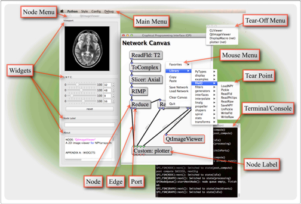

# Keyboard & Mouse Controls

 Fig. 1:  A screen-capture of an active GPI session with superimposed labels identifying each UI component. 

## Network Canvas

Key/Button | Function
--- | ---
Left Click | select Nodes or drag to select multiple Nodes
Middle Click + Drag | move the Network Canvas relative to view
Scroll Wheel | zoom in and out of the Network Canvas
Right Click | Mouse Menu
Tab | cycle Node selection
Ctrl/&#8984;+O | organize selected Nodes
Ctrl/⌘+L | load a network
Ctrl/⌘+S | save a network
Ctrl/⌘+C | copy selected Nodes
Ctrl/⌘+V | paste selected Nodes
Ctrl/⌘+P | toggle the pause state of the canvas (execution will halt until un-paused)
Spacebar | open Node Menu for selected Nodes
Delete/Backspace | delete selected Nodes
Up, Down, Left, Right Arrows | move selected Nodes across the Network Canvas

## Node Menu

Key/Button | Function
--- | ---
    Left Click | select Widget
    Left Double Click | show/hide Widget
    Middle Click + Drag | grab Widget and place in a layout or macro-node menu
    Right Click | open Widget-Port menu
    Tab | cycle focus through Widgets

## Node

Key/Button | Function
--- | ---
    Left Click | select Node
    Left Click+Drag | move Node
    Right Click | Node Menu
    Ctrl/⌘+Right Click | open the Node’s python code.
    Hover | display compute() wall time and total outport memory used

## Macro-Node

Key/Button | Function
--- | ---
    Left Double Click | open/close the macro

## Edge

Key/Button | Function
--- | ---
    Right Click | Edge delete menu

## Port

Key/Button | Function
--- | ---
    Middle Click | raise all connectable Ports
    Middle Click+Drag | draw connection Edge to another Port
    Hover | display Port type and held data information
