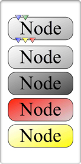

# User Interface
This section covers information about how specific aspects of the UI.
The figure below identifies most of the essential tools the user will need to construct a network, prototype algorithms and develop nodes.

 Fig. 1:  A screen-capture of an active GPI session with superimposed labels identifying each UI component. 

## Node & Port Color Code

 Fig. 2:  Node color code. 

GPI network manipulation tools are mostly accessible within the Mouse Menu which can be opened by right-clicking on the Network Canvas (Fig. 1).  From this menu, nodes can be instantiated, copy/paste, saved/loaded as a network, and the canvas can be completely cleared.  Node code, network description and data files can also be drag and dropped on the canvas from a file browser.  This will instantiate the Nodes associated with the code, description or data that has been dropped.

As Nodes are instantiated on the canvas they briefly turn dark grey indicating that they are running their kernel (compute() function) code.  As Nodes are connected and Widgets are modified they automatically trigger compute() events which flow down connections of the network.  This execution flow can be paused by selecting ‘Pause’ from the Mouse Menu.  Networks and Widgets can be modified in pause mode and will start execution when un-paused.

If GPI is launched from a terminal, all Node and Network Canvas information will be echoed to the terminal window.  This can aid in debugging runtime errors.  Additionally, the Nodes and Ports have a color code to indicate their status (Fig. 2).  The background color code is as follows: idle (light grey), running (dark grey), error (red), warning (yellow).  Error states do not allow the Node to be run again (the Node can be copied and pasted to retry).  The warning state (like the idle state) will allow the Node to reenter the event-loop.  The input Ports can be blue or green for required or optional input respectively.  The output Ports are blue (indicating success), yellow (unchanged), and red (no data and no downstream event).

The Network Canvas has a tabbed interface allowing more canvases to be instantiated and run simultaneously.  Nodes can then be copied and pasted between canvases allowing the user to easily consolidate emergent or spontaneous design changes.  Layouts, spawned from the Mouse Menu, can also be used to tie Widgets from various Nodes together, making a single unified ‘control panel’ for networks on a single canvas.  Finally, macro-Nodes can also be used to aggregate multiple Nodes into a single representation on the canvas.  A macro-Node is instantiated from the Mouse Menu.  Connections between the ‘Input’ and ‘Output’ Nodes are enveloped within the macro when either Node is double-clicked.Mouse & Keyboard Command List:
This section lists how to interact with the display items shown in Fig. 1.

